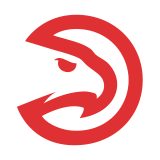

腾讯NBA的[这个页面](http://nba.stats.qq.com/team/list.htm)展示了东西部联盟的各个球队，而通过开发者工具可以发现更多json格式的详细信息。

本demo旨在获取与展示这些信息。

* TODO

	结合另一个demo: [nba_team_chart](https://github.com/jJayyyyyyy/network/tree/master/vuejs/demo/nba_team_chart)，来展示各支球队的在5项数据统计上的排名。

<br><br><br>

##  笔记

###  1.img

* 固定路径（原始html）

	index.html如下，其中，引号""里面就是图片的路径地址

	```html
	
	```

* 单个可变路径

	index.html如下

	```html
	<div id="app">
			
	</div>
	```

	对应地，app里面要有src，

	```javascript
	var app = new Vue({
			el: '#app',
			data: {
					imgSrc: './assets/2.png'
			}
	}
	```

	这样就可以通过改变`imgSrc`来改变某一个img标签指向的图片了

* basePath + 参数

	比如有10张图片放在`./assets/`目录中，图片名`1.png`, `2.png` ...

	Vue的文档里面有这么一句话

	>   Vue.js allows you to define filters that can be used to apply common text formatting.

	因此需要借助filter。html如下，其中`img_id`是图片名中的数字，如1，2，3... 而`getImage`是filter中的一个key

	```html
	<div id="app">
			
	</div>
	```

	Vue的options要添加filters

	```javascript
	var app = new Vue({
			el: '#app',
			data: {
					imgSrc: './assets/2.png'
			},

			// text formatting
			filters: {
					getImage: function(teamId){
							return `./assets/${teamId}.png`
					}
			},
	}
	```

